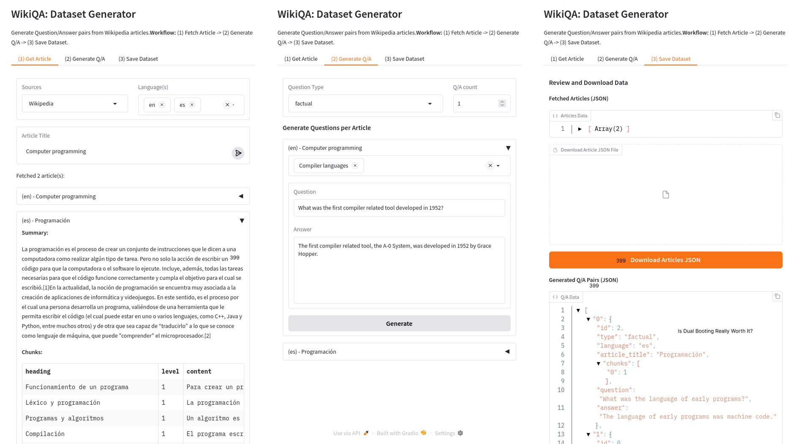

# WikiQA Dataset Creator

This is a tool to create Syntetic Datasets using Wikipedia and LLM. It was created to evaluate -> [RAG](https://github.com/humankernel/rag-revamped)

## Selected Documents

### Mathematics  
*   [Prime Numbers](https://en.wikipedia.org/wiki/Prime_number)
*   [Linear Algebra](https://en.wikipedia.org/wiki/Linear_algebra)
*   [Calculus](https://en.wikipedia.org/wiki/Calculus)
*   [Probability](https://en.wikipedia.org/wiki/Probability)

### Computer Science

*   [Algorithm](https://en.wikipedia.org/wiki/Algorithm)
*   [Data structure](https://en.wikipedia.org/wiki/Data_structure)
*   [Artificial intelligence](https://en.wikipedia.org/wiki/Artificial_intelligence)
*   [Computer programming](https://en.wikipedia.org/wiki/Computer_programming)

### Biology

*   [Cell (biology)](https://en.wikipedia.org/wiki/Cell_(biology))
*   [Genetics](https://en.wikipedia.org/wiki/Genetics)
*   [Evolution](https://en.wikipedia.org/wiki/Evolution)
*   [Ecology](https://en.wikipedia.org/wiki/Ecology)

### Physics

*   [Classical mechanics](https://en.wikipedia.org/wiki/Classical_mechanics)
*   [Electromagnetism](https://en.wikipedia.org/wiki/Electromagnetism)
*   [Quantum mechanics](https://en.wikipedia.org/wiki/Quantum_mechanics)
*   [Thermodynamics](https://en.wikipedia.org/wiki/Thermodynamics)

### General

*   [Batman](https://en.wikipedia.org/wiki/Batman)
*   [Dachshund](https://en.wikipedia.org/wiki/Dachshund)  
*   [Conspiracy theory](https://en.wikipedia.org/wiki/Conspiracy_theory)  
*   [Religion](https://en.wikipedia.org/wiki/Religion)  

## Types of Questions

<!-- questions that depend of prev history chat -->

[✔] 1. Factual Questions:

These questions seek specific, objective answers based on scientific facts or data.

    What is the chemical symbol for water?

    What is the speed of light in a vacuum?

    How many chromosomes do humans have?

2. MultiHop Questions:

These questions require combining multiple pieces of scientific information or performing sequential reasoning.

    If the half-life of Carbon-14 is 5,730 years, and a fossil has 25% of its original Carbon-14 remaining, how old is the fossil?

    Given that the density of water is 1 g/cm³ and the volume of a container is 500 cm³, what is the mass of the water it can hold?

3. Semantic Questions:

These questions involve interpreting the meaning or significance of scientific concepts or phenomena.

    What does the term "entropy" mean in thermodynamics, and how does it relate to disorder?

    How does the concept of "natural selection" explain the evolution of species over time?

4. Logical Reasoning Questions:

These questions require applying logical principles or scientific laws to solve problems.

    If a force of 10 N is applied to a 2 kg object, what is its acceleration according to Newton's second law?

    If a plant requires 6 hours of sunlight to produce 10 grams of glucose, how much glucose will it produce in 12 hours under the same conditions?

5. Creative Thinking Questions:

These questions require innovative or imaginative thinking to address scientific challenges or scenarios.

    How might you design an experiment to test the effects of microgravity on plant growth?

    What would be a potential solution to reduce carbon emissions in urban areas using renewable energy technologies?

6. Problem-Solving Questions:

These questions involve applying scientific formulas, principles, or methods to solve specific problems.

    Calculate the pH of a solution with a hydrogen ion concentration of 1 x 10⁻⁵ M.

    A ball is dropped from a height of 20 meters. How long will it take to hit the ground, assuming no air resistance?

7. Ethical and Philosophical Questions:

These questions explore the moral, ethical, or philosophical implications of scientific advancements or discoveries.

    Is it ethical to use CRISPR technology to genetically modify human embryos?

    Should scientists be held responsible for the potential misuse of their discoveries, such as nuclear weapons?

## Evaluation Metrics

[Key Metrics and Evaluation Methods for RAG - youtube](https://www.youtube.com/watch?v=cRz0BWkuwHg)

### Retrieval Metrics

#### Precision

$$\text{Precision} = \frac{\text{(True Positives)}}{(\text{True Positives} + \text{False Positives})}$$

- The proportion of relevant documents among the retrieved documents
- It measures if the info you've retrieved is highly relevant or not

#### Recall

$$\text{Recall} = \frac{\text{(True Positives)}}{(\text{True Positives} + \text{False Negatives})}$$

- The proportion of relevant documents that where successfully retrieved
- It measures if you aren't retrieving important information

#### Hit Rate 

- Proportion of queries for which at least one relevant document is retrieved withing the top few results
- It measures the system ability of retrieving relevant documents 

#### Mean Reciprocal Rank (MRR)

$$\text{MRR} = (1 / Q) * \sum(1 / R_1)$$

$Q$: total number of queries \
$R_1$: rank of the first relevant document

- How high the most relevant document appears in the search result
- It measures the system ability to prioritize top results
- Used when the top document is the most important

#### Normalized Discounted Cumulative Gain (NDCG)

$$DCG_p=\sum_{i=1}^p\frac{2^{rel_i}-1}{\log_2(i+1)}$$

- It measures the ranking quality of all documents by considering both relevance and order
- Used when the entire top_k retrieved docs are important

#### Mean Average Precision (MAP)

- It measures the effectiveness of a system at returning relevant documents across multiple queries.
- First, Average Precision (AP) evals how well relevant documents are ranked within the retrieved documents. It’s computed by averaging the precision values for each position of relevant document in the ranking of all the retrieved documents:

$$\textbf{AP}=\frac{\sum_{k=1}^{M}\text{Relevance}(k) \times \text{Precision}(k)}{|{\text{Relevant Docs}}|}$$

$M$ is the total number of documents retrieved.

$\text{Relevance}(k)$ is a binary value, indicating whether document at position $k$ is relevant (=1) or not (=0).

$\text{Precision}(k)$ is the precision when considering only top $k$ retrieved items.

Then calculate the average AP across multiple queries to get the MAP:

$$\textbf{MAP}=\frac{1}{N}\sum_{i=1}^{N}\text{AP}_i$$

$N$ is the total number of queries.

$\text{AP}_i$ is the average precision of the $i^{th}$ query.

### Generation Metrics 

#### Faithfulness

> **Question**: Where and when was Einstein born?
> **Context**: Albert Einstein (born 14 March 1879) was a German-born theoretical physicist, widely held to be one of the greatest and most influential scientist of all time.
>
> **High faithfulness answer**: Einstein was born in Germany on 14th March 1879
> **Low faithfulness answer**: Einstein was born in Germany on 20th March 1879

- Ensures response reflect accurate relevant document information without errors

#### Answer Relevancy

> **Question**: Where is France and what is it's capital?
> **Low relevance answer**: France is in western Europe
> **High relevance answer**: France is in western Europe and Paris is its capital 

- Evaluate the answer relevance to the original query

#### Answer Correctness

> **Ground truth**: Einstein was born in 1879 in Germany.
> **High answer correctness**: In 1879, Einstein was born in Germany
> **Low answer correctness**: Einstein was born in Spain in 1879

- Assess if the answer align with a query reference answer (ground truth)
